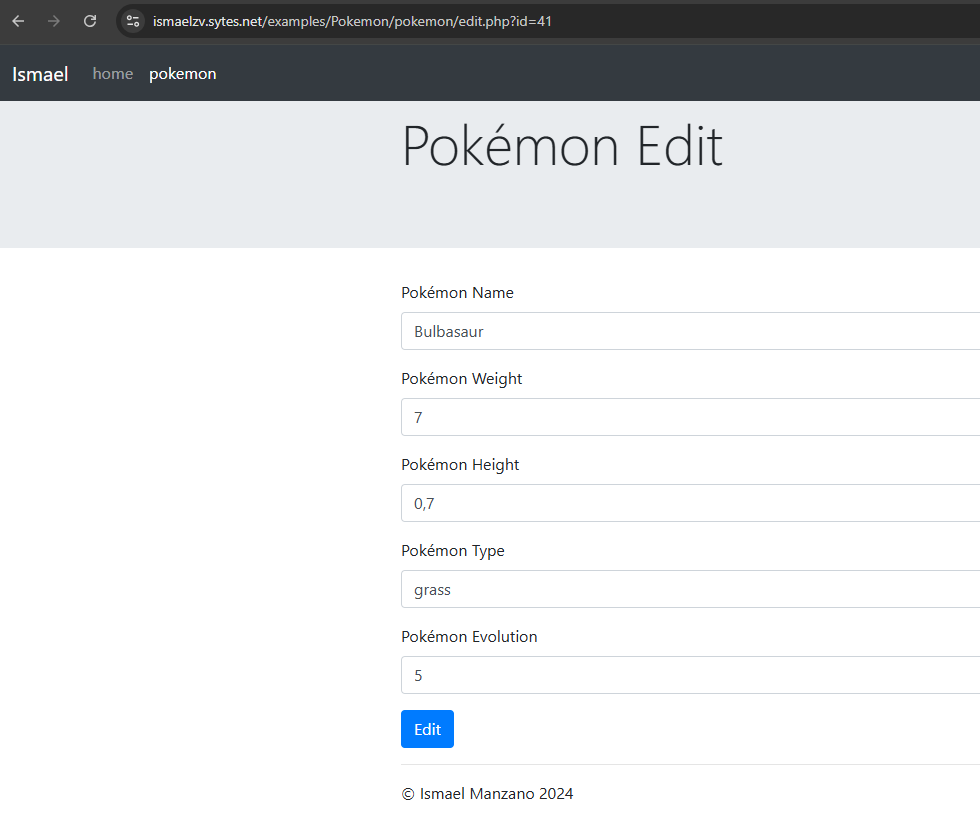

# TraditionalAppPHPPokemon

## Descripción

traditionalApp es una aplicación web para gestionar una base de datos de Pokémon. Permite a los usuarios iniciar sesión, ver, crear, editar y eliminar registros de Pokémon.

## Estructura del Proyecto

```
database.sql
index.php
LICENSE
pokemon/
    create.php
    destroy.php
    edit.php
    index.php
    js/
        script.js
    show.php
    store.php
    update.php
README.md
user/
    login.php
    logout.php
```

## Instalación

1. Clona el repositorio:
        ```sh
        git clone https://github.com/IsmaelManz26/PokemonTraditionalApp.git
        ```

2. Configura la base de datos:
        - Crea la base de datos y el usuario ejecutando el script `database.sql` en tu servidor MySQL.

3. Configura el servidor web:
        - Asegúrate de que tu servidor web esté configurado para servir los archivos PHP.

## Uso

1. Inicia sesión:
        - Visita `user/login.php` y proporciona un nombre de usuario.

2. Gestiona Pokémon:
        - Visita `pokemon/` para ver la lista de Pokémon.
        - Usa las opciones para crear, editar, ver o eliminar Pokémon.

## Archivos Principales

- `index.php`: Página principal de la aplicación.
- `user/login.php`: Página de inicio de sesión.
- `user/logout.php`: Página de cierre de sesión.
- `pokemon/index.php`: Lista de Pokémon.
- `pokemon/create.php`: Formulario para crear un nuevo Pokémon.
- `pokemon/edit.php`: Formulario para editar un Pokémon existente.
- `pokemon/show.php`: Página para mostrar los detalles de un Pokémon.
- `pokemon/destroy.php`: Script para eliminar un Pokémon.
- `pokemon/store.php`: Script para almacenar un nuevo Pokémon en la base de datos.
- `pokemon/update.php`: Script para actualizar un Pokémon existente en la base de datos.
- `pokemon/js/script.js`: Script JavaScript para manejar la confirmación de eliminación.

## Contribuciones

Las contribuciones son bienvenidas. Por favor, sigue los siguientes pasos para contribuir:

1. Haz un fork del proyecto.
2. Crea una nueva rama (`git checkout -b feature/nueva-funcionalidad`).
3. Realiza los cambios necesarios y haz commit (`git commit -am 'Añadir nueva funcionalidad'`).
4. Sube los cambios a tu repositorio (`git push origin feature/nueva-funcionalidad`).
5. Abre un Pull Request.


## Capturas

Home


Home de pokemon con la lista


Loggin impares


Loggin pares


Pagina de creacion de un pokemon nuevo


Página de edición de un pokemon 



Página de view de un pokemon 


Página de delete de un pokemon 


## Licencia

Este proyecto está licenciado bajo la Licencia Apache 2.0. Consulta el archivo [LICENSE](LICENSE) para más detalles.

## Contacto

Para cualquier consulta o sugerencia, por favor contacta a [imanrei343@ieszaidinvergeles.org](imanrei343@ieszaidinvergeles.org).
